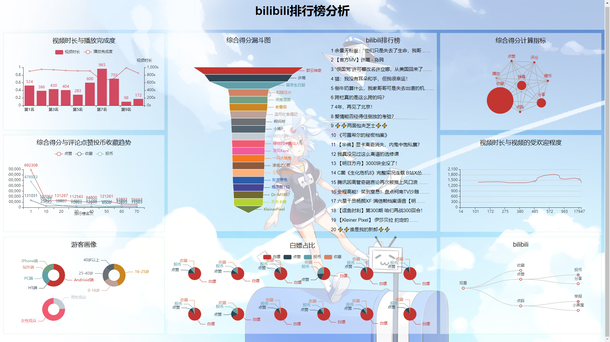

## 哔哩哔哩排行榜数据分析与可视化

#### 以下内容是直接从实验报告中copy出来的，以后再改markdown了，准备考研，忙着背单词  ：)

#### 整体是 flask + pyecharts +flexible自适应布局 + request爬虫 
#### 分析什么的有很多从网上抄的，为了莽个课程设计，先这样吧就。

1.  **可视化目标与任务**

2.  可视化任务选择

>   目前视频行业可以分为爱优腾为代表的长视频赛道，快手抖音为代表的短视频赛道，以及B站，B站的视频内容十分的丰富，因为独特的社区属性和基于UP主们的原创内容，打造了一个通过内容交流给用户带来愉悦感的社区型平台。

>   长视频类型的平台就是指通过大量优质自制剧、综艺和电影版权来获取会员，对标的是Netflix。比如一部有可能要火的电视剧或者资源，各大视频平台会疯狂砸重金买版权。因为大家都明白，买下这块版权，就会吸引到想要关注这块内容的海量用户（中国在线视频用户以每年28%的增速在增长），也就会有很多的人去充值会员，甚至于超前点播等。但中国目前三大视频平台后面站的正是BAT
>   IT三巨头，谁都不缺钱。那这就意味着谁都想吃下这块蛋糕，所以都将内容版权炒上了天价，以至于目前这个赛道上，各家都是集体亏损的状态，而到了真正垄断的那天，很难预测会是什么样的局面。

图 1 某长视频平台VIP界面

>   短视频行业风头正茂，近年来，随着互联网事业的蓬勃发展，手机终端的智能化越来越高，在这样的背景下，视频产品也发生了翻天覆地的变化。从电影到微电影，从微电影到短视频，作品的体量越来越小，表达内容越来越集中，快餐文化的盛行，我不想谈什么，也谈不了什么，劝别人不刷某音手，无异于痴人说梦，尼尔·波兹曼在《娱乐至死》中提到：现实社会的一切公众话语日渐以娱乐的方式出现，并成为一种文化精神。人们的政治、宗教、新闻、体育、教育和商业都心甘情愿的成为娱乐的附庸，其结果是人们成了一个娱乐至死的物种。以前或许是劝人读书，以后或许是劝人看看一部电影本身，看看一部电视剧，而不是沉浸在几分钟的电影解说，沉沦在快餐文化这一精神鸦片之中。

>   图2是我在写下此篇文字报告时在安卓模拟器中下载的某软件，刚刚打开，往下稍微翻了，女性用户看到这种推荐是什么想法？应该不至于新的模拟器中也有我自己泄露的个人信息吧？当然短视频平台也有很多优秀的地方，也有很多优质的博主，不过我的自控力还是挺差的，所以还是敬而远之了。

图 2 某短视频平台截图

>   B站则比较的不同，当然因为更多元也有很多低质量糟粕的东西，目前比较像YouTube，但B站没有阻碍观看内容的广告，这点很好，看YouTube时几分钟一次的广告影响人的体验也是很严重的，而且YouTuber们往往都会把视频放在视频的关键的点，让你必须在那几秒的广告之时还保持高度的集中，以便快速跳过，B站的恰饭机制就非常的不错，up主们可以结合自己的内容来进行恰饭，甚至可以为恰饭做出带有个人风格的视频，带有自己特色的同时也完成了甲方爸爸的要求，而且恰饭的视频也不是强制性的，甚至可以完全不看，完全跳过。

>   除此之外，内容方面也是值得一谈的，视频的时长上，长、中、短视频均有，B站最独特的优势就在于UGC，用户原创内容占多数，B站独特的社区属性和基于UP主们的原创内容和一定的PGC视频，而围绕建立的各类圈层文化，明显区别于“爱优腾”这类以长视频内容见长的主流长视频平台。打开B站首页，罗列的热门排行中，几乎是清一色的原创视频，来自不同版区，每个都高达数十万甚至百万的播放量，以及上千过万的弹幕。

图 3 我的推送，内容因人而异

>   在B站，最受欢迎的从来不是大热的动画和影视剧等长视频内容，点击量表现好的，大多是UP主们原创的视频，分散在各个领域，如音乐区、游戏区、鬼畜区等，这些原创视频帮助B站默默收割着播放量。

>   而B站在二次元领域的多年耕耘，自带的二次元圈层属性，也不同于以抖音、快手等为代表的短视频平台所引领的“新视频文化”。

>   B站的特色是悬浮于视频上方的实时评论功能，爱好者称其为“弹幕”，这种独特的视频体验让基于互联网的弹幕能够超越时空限制，构建出一种奇妙的共时性的关系，形成一种虚拟的部落式观影氛围，让B站成为极具互动分享和二次创造的文化社区。B站目前也是众多网络热门词汇的发源地之一。

>   所以我们本次想要完成哔哩哔哩排行榜的数据分析与可视化，第一是分析能够“火”起来的视频都有什么样的特征，以便up主们能够创作出更优质的内容，第二是想看一下在这个快餐文化盛行的时代里，哔哩哔哩作为独特与其上两种形态的内容，有什么其特色，为何能够拿下一片视频领域的江山。

1.  可视化方案规划

图 4

图 5 最终效果图

>   为了便于后续的数据的使用，我们从老师规定的三种可视化方案中选择了pycharts方案，因而后端也就选择了Flask，一个使用Python编写的轻量级
>   Web应用框架。

>   对于数据的抓取，则选取了Urllib这一python内置的HTTP请求库来进行抓取。

>   对于前端，我们采用了flexible使用rem自适应布局，使用jQuery
>   Ajax对图表进行实时的更新。

>   对于数据处理，主要使用到了python的一些内置库，除此之外，对于综合评分分析中，使用到了灰色关联度分析与主成分分析，用到了sklearn库，详细的内容在可视化部分进行详解。

1.  **数据处理方案**

本次数据来源于哔哩哔哩排行榜，服务器后台中每5min对排行榜数据爬取，通过jQuery
Ajax+flask实时更新到网页上。

以下是数据爬取过程：

本次爬虫教程使用requests第三方库，一个强大的基于urllib3的第三方库。

首先分析哔哩哔哩排行榜的源码：

图 6

不难发现榜单都在 \< li
\>标签中，所以可以先找出该全部标签，然后再详细分析里面的信息。

图 7

可以看出，大厂的网站写的还是很棒的，很有体系，可以说bilibili甚至很适合新手来练手爬虫。

因为比较条理且为静态网页，直接使用requests，遍历li并对其进行find操作，找到对应标签内的内容，存储即可完成热榜爬取。

此时部分数据需进行一定的处理，但均较为简单，转换格式以及去除空格、‘\\n’等。

但哔哩哔哩排行榜的内容只包括排名,视频名称、播放量、弹幕数、综合得分、作者、链接，并没有更加重要的投币、点赞、转发和收藏等关键信息。所以还需要对每一个页面内部进行爬取。

后续代码中的info_Page(bv)对此进行了实现，bv代表的是哔哩哔哩每个视频对应的唯一的bv号，使用此bv添加网站后缀即可完成info页面的访问，在info页面中，依旧十分易于爬取。

图 8

但此时爬取速度过快时会触发其反爬策略，且较难处理，故后续采用其提供接口获取内部详细数据。使用<http://api.bilibili.com/x/web-interface/view?bvid=>
+ bv号形式获取数据，后续只需进行格式处理即可完成。

图 9

最后数据保存入bilibili.txt文件中，数据的运用及处理在各可视化案例中详细介绍。

爬虫部分到此结束：

附 爬虫代码：

1.  **import** requests  

2.  **from** bs4 **import** BeautifulSoup  

3.  **import** xlwt  

4.  **import** time  

5.  **import** urllib3  

6.  **import** requests  

7.  **import** json  

8.  \# 爬取B站热榜排行  

9.  \# 格式解析，[0-当前排名，1-视频标题，2-播放数目，3-弹幕数量，4-综合得分，5-作者，6-视频地址，7-时长，8-评论数，9-收藏数，10-投币数，11-分享数，12-点赞数]  

10. \# 格式化  

11. **def** whitespace(st):  

12.     st = st.replace('\\n', '')  

13.     st = st.strip()  

14.     st = st.replace(' ', '')  

15.     **return** st  

16. \# 详情页  

17. **def** info_Page(bv):  

18.     url = 'http://api.bilibili.com/x/web-interface/view?bvid=' + bv  

19.     headers = {  

20.         "User-Agent": "Mozilla/5.0 (Windows NT 10.0; Win64; x64) AppleWebKit/537.36 (KHTML, like Gecko) Chrome/81.0.4044.129 Safari/537.36"  

21.     }  \# 请求头，模拟浏览器的运行  

22.     urllib3.disable_warnings()  \# 从urllib3中消除警告  

23.     response = requests.get(url, headers=headers)  

24.     content = json.loads(response.text)  

25.     \# 很迷，获取到的是str字符串 需要解析成json数据  

26.     statue_code = content.get('code')\# print(statue_code)  

27.     **if** statue_code == 0:  

28.         duration = content['data']['duration'] \# 时长  

29.         reply = content['data']['stat']['reply'] \# 评论  

30.         favorite = content['data']['stat']['favorite'] \# 收藏  

31.         coin = content['data']['stat']['coin'] \# 投币  

32.         share = content['data']['stat']['share'] \# 分享  

33.         like = content['data']['stat']['like'] \# 点赞  

34.     **return** duration,reply,favorite,coin,share,like  

35. **while**(True):  

36.     url = 'https://www.bilibili.com/v/popular/rank/all'  

37.     headers = {  

38.         'User-Agent': 'Mozilla/5.0 (Windows NT 10.0; Win64; x64) AppleWebKit/537.36 (KHTML, like Gecko) Chrome/89.0.4389.90 Safari/537.36'}  

39.     rank = requests.get(url, headers=headers)  \# 请求页面  

40.     soup = BeautifulSoup(rank.text, 'lxml')  

41.     all_rank = soup.find_all('li', class_='rank-item')  

42.     num = 0  

43.     lst=[]  

44.     **for** i **in** all_rank:  

45.         record = []  

46.         rank_num = i.find('div', class_='num').text  \# 获取排名  

47.         info = i.find('div', class_='info')  \# 筛选出视频详细信息的标签  

48.         href = info.find('a', class_='title').attrs['href']  \# 获取链接  

49.         title = info.find('a', class_='title').text  \# 获取标题  

50.         play_num = info.find('i', class_='b-icon play').parent.text  \# 获取播放量  

51.         view_num = info.find('i', class_='b-icon view').parent.text  \# 获取弹幕数  

52.         author = info.find('i', class_='b-icon author').parent.text  \# 获取作者名  

53.         scores = info.find('div', class_='pts').find('div').text  \# 获取综合得分  

54.         \# 播放，弹幕，作者  

55.         play_num = whitespace(play_num)  

56.         view_num = whitespace(view_num)  

57.         author = whitespace(author)  

58.         bv = href.split('/')[-1]  

59.         duration,reply,favorite, coin,share,like = info_Page(bv)  

60.         record.append(rank_num)  

61.         record.append(title)  

62.         record.append(play_num)  

63.         record.append(view_num)  

64.         record.append(scores)  

65.         record.append(author)  

66.         record.append(href)  

67.         record.append(duration)  

68.         record.append(reply)  

69.         record.append(favorite)  

70.         record.append(coin)  

71.         record.append(share)  

72.         record.append(like)  

73.         num += 1  

74.         lst.append(record)  

75.     \# 爬取的数据存入文件，避免多次爬取且提高响应速度  

76.     with open('./bilibili.txt', 'w',encoding='utf-8') as f:  

77.         **for** line **in** lst:  

78.             **for** i **in** line:  

79.                 f.write(str(i)+',')  

80.             f.write('\\n')  

81.     time.sleep(300)  

82. \#print(lst[0])  

83. **可视化呈现方案**

84. 综合得分计算指标

>   哔哩哔哩综合得分，是视频是否能排上排行榜的依据，若能知道其规则，对于视频内容的倾向，up主是否需要请求“一键三连”，观众们需不需要吝啬手中的币，是有很大的价值的，所以在此首先进行综合得分计算指标的分析及其可视化，此处采取灰色关联度分析（Grey
>   Relation Analysis，GRA）来进行数据的处理，

>   GRA是一种多因素统计分析的方法。简单来讲，就是在一个灰色系统中，我们想要了解其中某个我们所关注的某个项目受其他的因素影响的相对强弱，本项目中，就是说：我们假设B站综合得分可能是与播放、评论、收藏、投币、分享、点赞几个因素相关的，那么我们想知道综合得分与这几个因素中的哪个相对来说更有关系，而哪个因素相对关系弱一点，把这些因素排个序，得到一个分析结果，我们就可以知道哔哩哔哩综合得分，与因素中的哪些更相关，因而也就可以看出观众的一键三连的作用以及up主们更应该求的是赞、币亦或是其他。

>   首先是要确定子母序列，母是结果，子是影响因子，那么，毫无疑问，综合得分就是母，其他均为影响因子。将其分别存入mom_以及son_中，代码如下：

1.  with open('./bilibili.txt', 'r+',encoding='utf-8') as f1:  

2.      lst2=[]  

3.      **for** line **in** f1.readlines():  

4.          lst2.append(line.split(','))  

5.  mom_ = [int(i[4]) **for** i **in** lst2[0:50:]]  

6.  view = []  

7.  reply = []  

8.  favorite = []  

9.  coin = []  

10. share = []  

11. like = []  

12. **for** i **in** lst2[0:50]:  

13.     view.append(float(i[2].strip("万"))\*10000)  

14.     reply.append(int(i[8]))  

15.     favorite.append(int(i[9]))  

16.     coin.append(int(i[10]))  

17.     share.append(int(i[11]))  

18.     like.append(int(i[12]))  

19. son_ = [view,reply,favorite,coin,share,like]  

>   然后要对数据进行预处理，因为我们的这些要素是不同质的东西的指标，因此可能会有的数字很大有的数字很小，但是这并不是由于它们内禀的性质决定的，而只是由于量纲不同导致的，因此我们需要对它们进行无量纲化。这个操作一般在数据处理领域叫做归一化（normalization），也就是减少数据的绝对数值的差异，将它们统一到近似的范围内，然后重点关注其变化和趋势。按公式归一化即可。

1.  mom_ = np.array(mom_)  

2.  son_ = np.array(son_)  

3.  son_ = son_.T / son_.mean(axis=1)  

4.  mom_ = mom_/mom_.mean()  

5.  **for** i **in** range(son_.shape[1]):  

6.      son_[:,i] = abs(son_[:,i]-mom_.T)  

7.  Mmin = son_.min()  

8.  Mmax = son_.max()  

9.  cors = (Mmin + 0.5\*Mmax)/(son_+0.5\*Mmax)  

10. Mmean = cors.mean(axis = 0)  

>   最终结果：B站综合得分与播放、评论、收藏、投币、分享、点赞几个因素都具有很强的相关性。

图 10

>   为了体现这一结果，我们采用了关系图来进行可视化：

图 11

>   由于灰色关联度分析的权重均较为接近，但哔哩哔哩综合得分的公式也并没有公布，所以无从证实其真实性，下图为网传数据进行的关系图可视化，均仅供参考：

图 12

>   附： 灰色关联度分析及可视化

1.  \# 灰色关联度分析版本  

2.  **import** numpy as np  

3.  **from** pyecharts **import** options as opts  

4.  **from** pyecharts.charts **import** Graph  

5.  with open('./bilibili.txt', 'r+',encoding='utf-8') as f1:  

6.      lst2=[]  

7.      **for** line **in** f1.readlines():  

8.          lst2.append(line.split(','))  

9.  mom_ = [int(i[4]) **for** i **in** lst2[0:50:]]  

10. view = []  

11. reply = []  

12. favorite = []  

13. coin = []  

14. share = []  

15. like = []  

16. **for** i **in** lst2[0:50]:  

17.     view.append(float(i[2].strip("万"))\*10000)  

18.     reply.append(int(i[8]))  

19.     favorite.append(int(i[9]))  

20.     coin.append(int(i[10]))  

21.     share.append(int(i[11]))  

22.     like.append(int(i[12]))  

23. son_ = [view,reply,favorite,coin,share,like]  

24. mom_ = np.array(mom_)  

25. son_ = np.array(son_)  

26. son_ = son_.T / son_.mean(axis=1)  

27. mom_ = mom_/mom_.mean()  

28. **for** i **in** range(son_.shape[1]):  

29.     son_[:,i] = abs(son_[:,i]-mom_.T)  

30. Mmin = son_.min()  

31. Mmax = son_.max()  

32. cors = (Mmin + 0.5\*Mmax)/(son_+0.5\*Mmax)  

33. Mmean = cors.mean(axis = 0)  

34. \# 为便于观察 扩大40倍  

35. nodes = [  

36.     {"name": "播放", "symbolSize": Mmean[0]\*40},  

37.     {"name": "评论", "symbolSize": Mmean[1]\*40},  

38.     {"name": "收藏", "symbolSize": Mmean[2]\*40},  

39.     {"name": "投币", "symbolSize": Mmean[3]\*40},  

40.     {"name": "分享", "symbolSize": Mmean[4]\*40},  

41.     {"name": "点赞", "symbolSize": Mmean[5]\*40},  

42. ]  

43. links = []  

44. **for** i **in** nodes:  

45.     **for** j **in** nodes:  

46.         links.append({"source": i.get("name"), "target": j.get("name")})  

47. c = (  

48.     Graph()  

49.     .add("", nodes, links, repulsion=8000)  

50.     .set_global_opts(title_opts=opts.TitleOpts(title="综合得分计算指标"))  

51. )  

52. c.render_notebook()  

53. 综合得分漏斗图

图 13

>   通过综合得分漏斗图可以看出，除了前三名视频以外，其他的视频差距都不是很大，其它的视频的宽度差距不大，4-20名的差距基本很小，这也说明了其名次十分焦灼，变化也比较快。

>   推测前三名视频是由于挂在了榜上，所以导致其经常被推送已经看排行榜的人观看，即便此视频的标题等对其可能并没有很大的吸引力。

>   而后续的视频，可能游客就只会对其感兴趣的视频来进行浏览，不同兴趣的用户分别点击不同的视频，

>   也就导致了后续视频的差距很小，十分焦灼。在此部分，作者的标题与粉丝基数可能会对名次产生较大的影响。

>   在分析的过程中，我发现很多的视频标题中都带有感叹号与问号等字符，或许可以对一段时间内的排行榜进行数据的采集，然后进行标题的分析，或许也能找到一些吸引游客关注的方案（一定程度内，拒绝标题党）。

>   附 ：

1.  **from** pyecharts **import** options as opts  

2.  **from** pyecharts.charts **import** Funnel  

3.  data_fun = [[i[5],int(i[4])] **for** i **in** lst[0:20]]  

4.  \# 创建 Funnel 对象  

5.  funnel_demo = (  

6.      Funnel(init_opts=opts.InitOpts(  

7.                                  width= '800px',  

8.                                  height='700px',  

9.                                  page_title='page',  

10.                                 ))  

11.     .add("", data_fun, sort_='descending')  

12.     .set_global_opts(title_opts=opts.TitleOpts(title=""),legend_opts=opts.LegendOpts(is_show = False))  

13.     .set_series_opts(label_opts=opts.LabelOpts(is_show= True,  

14.                                                position = "right",  

15.                                               \#font_size = 12,  

16.                                               ))  

17. )  

18. funnel_demo.render_notebook()  

19. 游客画像

图 14

>   哔哩哔哩游客画像分析，因为课程设计的时间关系，本次爬虫中主要对于排行榜视频进行爬取，以及部分排行榜作者的信息，所有并没有太多的游客的信息，本部分可视化的信息来自于我的哔哩哔哩后台数据，具有很大的个人倾向，而且数据规模也比较小。

>   我的视频以游戏视频为主，受众也的确多为16-25岁之间的人群，但很难以置信的是在35-40岁之间还有很多的受众，这对于视频博主来说更改自己的视频策略是非常重要的。

>   在游客的性别方面，也十分的出乎意料，我的游戏视频并没有明显的性别倾向，但女性观众的比例竟然都大于了3/4，这也是很难以置信的，以后也可以根据自己的受众来合理的制作视频。

>   对于视频观看途径，毫无悬念的Andrioid占据上风，紧随其后的是PC端与iPhone端，而站外播放几乎没有。

>   附：

1.  **from** pyecharts **import** options as opts  

2.  **from** pyecharts.charts **import** Pie  

3.  c = (  

4.      Pie()  

5.      .add(  

6.          "",  

7.          [list(z) **for** z **in** zip(["Andrioid端", "H5端", "PC端", "站外端", "iPhone端"], [60, 0, 23, 0, 17])],  

8.          center=["30%", "30%"],  

9.          radius=['15%', '30%'],  

10.     )  

11.     .add(  

12.         "",  

13.         [list(z) **for** z **in** zip(["16-25岁", "0-16岁","25-40岁","40岁以上",], [44, 23,21,13])],  

14.         center=["70%", "30%"],  

15.         radius=['15%', '30%'],  

16.     )  

17.     .add(  

18.         "",  

19.         [list(z) **for** z **in** zip(["男性观众", "女性观众"], [24, 76])],  

20.         center=["30%", "75%"],  

21.         radius=['15%', '30%'],  

22.     )  

23.     .set_colors(["\#8be09c","\#ffc573","\#5ddfff","\#ff9db5"])  

24.     .set_global_opts(  

25.         title_opts=opts.TitleOpts(title="游客画像"),  

26.         legend_opts=opts.LegendOpts(  

27.             is_show = False  

28.         ),  

29.     )  

30. )  

31. c.render_notebook()  

图 15

>   对于排行榜上的视频，视频的完成度均是特别高的，大多都处于很高的程度，但一些多p的较长的录播类型的视频播放完成度会有些稍低，如第七名。另外较短的视频的完成度均特别高，如第九名。推测视频的完成度也会对视频的综合得分有部分影响，

>   因为第九名这一视频的其他数据并非是特别突出，但仍在排行榜前列。后面的灰色关联度分析因为视频完成度比较难以无纲量化，并没有对其进行分析，是一缺憾。但哔哩哔哩对播放完成度统计并计算也正体现当前时代的趋势，快餐文化的盛行。

>   但哔哩哔哩的很多博主还是很令人高兴的，并没有在快文化盛行的今天选择以快文化来吸引流量，还是选择了高质量，这一部分在视频时长与综合得分处进行详解。

>   附：

1.  **from** pyecharts **import** options as opts  

2.  **from** pyecharts.charts **import** Bar, Grid, Line  

3.  Line_Bar_Grid = []  

4.  **for** i **in** lst[0:10:]:  

5.      Line_Bar_Grid.append(int(i[7]))  

6.  x_data = ["第{}名".format(i) **for** i **in** range(1, 11)]  

7.  bar = (  

8.      Bar()  

9.      .add_xaxis(x_data)  

10.     .add_yaxis(  

11.         "视频时长",  

12.         [i **for** i **in** Line_Bar_Grid],  

13.         yaxis_index=0,  

14.         color="\#d14a61",)  

15.     .set_global_opts(  

16.         legend_opts=opts.LegendOpts(is_show = True,  pos_left = '30%',),  

17.         yaxis_opts=opts.AxisOpts(  

18.             name="视频时长",  

19.             position="right",  

20.             axisline_opts=opts.AxisLineOpts(  

21.             ),  

22.             axislabel_opts=opts.LabelOpts(formatter="{value}s"),  

23.         ),)  

24.     )  

25. line = (  

26.     Line()  

27.     .add_xaxis(x_data)  

28.     .add_yaxis(  

29.         "播放完成度",  

30.         [i for i in range percentage_num],  

31.         yaxis_index=2,  

32.         color="\#675bba",  

33.         label_opts=opts.LabelOpts(is_show=False),  

34.     )  

35.     .set_global_opts(legend_opts=opts.LegendOpts(is_show = True,  pos_right = '30%',))  

36. )  

37. grid = (  

38.     Grid()  

39.     .add(bar, grid_opts=opts.GridOpts())  

40.     .add(line, grid_opts=opts.GridOpts())  

41. )  

42. grid.render_notebook()  

图 16

>   本处数据对排行榜100条数据每10条取其综合得分平均值与点赞投币收藏平均值，来计算综合得分与其余三者的变化趋势，可以显而易见的看出，综合得分与其三者之间存在着明显的线性相关性，这也对我们后续的灰色关联度分析给出了提示，

>   由于采用取平均值的形式，所以基本没有出现投币大于点赞也就是“币比赞多”的情况，但在点赞投币收藏比例图中对此进行了体现。

>   可以看出，整体来说点赞大于投币大于收藏，并非是需要获得的投币是最少的，收藏反而是最少的，收藏的视频一般都是可以二次观看的为主，收藏的数量较少应当就是这种原因导致的。

>   附：

1.  **import** pyecharts.options as opts  

2.  **from** pyecharts.charts **import** Line  

3.  line_Thread = []  

4.  **for** i **in** lst[0:80:10]:  

5.      play = float(i[2].strip("万"))  

6.      line_Thread.append([int(i[4]),int(play\*10000),int(i[12]),int(i[8]),int(i[9]),int(i[10])]) \# 综合得分，播放，点赞，评论，收藏，投币  

7.  **print**(line_Thread)  

8.  **print**([i[1] **for** i **in** line_Thread])  

9.  c = (  

10.     Line()  

11.     .add_xaxis(['1','10','20','30','40','50','60','70',])  

12.     \#.add_yaxis("播放", [i[1] for i in line_Thread]) \# 播放数目  

13.     .add_yaxis("点赞", [i[2] **for** i **in** line_Thread])  

14.     \#.add_yaxis("评论", [i[3] for i in line_Thread]) \# 评论数过少  

15.     .add_yaxis("收藏", [i[4] **for** i **in** line_Thread])  

16.     .add_yaxis("投币", [i[5] **for** i **in** line_Thread])  

17.     .set_global_opts(\#title_opts=opts.TitleOpts(title="综合得分与评论点赞投币收藏趋势"),  

18.                    yaxis_opts=opts.AxisOpts(name="综合得分",name_location="center", name_gap=70),  

19.                     xaxis_opts=opts.AxisOpts(name="排行榜名次",name_location="center"))  

20. )  

21. c.render_notebook()  

图 17

>   分析前排行榜前20条视频的点赞、投币、收藏与白嫖的比例，可以明显的看出，即便是这么高质量的视频，大多数的人还是选择了白嫖
>   = =

>   具体查看每个图表的标题或内容可知，投币大于点赞即“币比赞多”是很少见的情况，常出现于爱心救助，

>   比如救助流浪狗，流浪猫，等能引起用户共鸣与感动的视频，除此之外另一种“币比赞多”的情况多出现于视频质量极高，制作难度极高，视频质量极高，让人直接把币拱手相让类型的，比如本次榜单上的mad混剪，e3d，时间重映射，发光抖动，放射光线(评论区说的)工程难度极高。

>   附：

1.  **from** pyecharts **import** options as opts  

2.  **from** pyecharts.charts **import** Pie  

3.  **from** pyecharts.commons.utils **import** JsCode  

4.  b_pie=[]  

5.  **for** i **in** lst[0:12]:  

6.      play = float(i[2].strip("万"))  

7.      like = int(i[12])  

8.      coin = int(i[10])  

9.      favorite = int(i[9])  

10.     b_pie.append([i[1],[("白嫖",play\*10000 - like - coin - favorite),("点赞",like),("投币",coin),("收藏",favorite)]])  

11. x=10  

12. y=25  

13. pie_demo = (Pie())  

14. **for** i **in** b_pie:  

15.     x_term = str(x)+'%'  

16.     y_term = str(y)+'%'  

17.     \#print(x_term,y_term)  

18.     pie_demo.add(i[0], i[1],center=[x_term,y_term],radius='16%',)  

19.     x+=16  

20.     **if**(x\>=100):  

21.         x=10  

22.         y+=50  

23. \#pie_demo.set_global_opts(title_opts=opts.TitleOpts(title="白嫖数量"))  

24. pie_demo.render_notebook()  

图 18

>   本处的视频分析逻辑并不是很严谨，因为所有的数据均为排行榜视频数据，视频的综合得分均比较高，时长的分析应当有更加大规模的数据来进行测试与处理。但实时的对排行榜数据进行分析也能看出一些趋向。

>   最终可以得知，视频时长与视频的受欢迎程度是有关系的，在8min到13min附近的视频最为受欢迎，这是很令人意外的，bilibili优质视频的时长都没有太短，值得up主们考量。

图 19

1.  **总结**

2.  总结

经过这学期数据可视化课程的学习，我深深的意识到了数据可视化的魅力，在进行理解和学习的任务的时候,图文一起能够帮助读者更好的了解所要学习的内容,
图像更容易理解,更有趣,也更容易让人们记住。数据可视化将技术与艺术完美结合，借助图形化的手段，清晰有效地传达与沟通信息。一方面，数据赋予可视化以价值;另一方面，可视化增加数据的灵性，两者相辅相成，更直观、更具象的将数据呈现到了我们面前。

而在这数天的课程设计之中，我的设计水平也在不断地提高，先后接触学习了flask、flexable、灰色关联度分析、Ajax等诸多从未接触过的知识，在设计的过程中，水平也在不断提升，最终合作完成了数据可视化的项目。

总体来说，通过这次的课程设计，我想自己也已经迈入了可视化的大门，在以后的日子里，在自己不断地进步之中，行稳致远，进而有为。

1.  思考

互联网的快速发展，人们越发的崇尚简单、形象、快捷、趣味性的文化产品，例如，电视、微博、抖音、快手等这些信息传播媒介，它们均都是“快餐文化”产物的代表。现代科技发展的越来越好、也越来越快。人们的生活，尤其是年轻人的生活节奏越来越快，工作压力越来越大，好像全社会都进入了快餐、速食的时代。快餐文化如同流水一般不动声色地进入了大众的视野。

视频的兴起，其本质也是一种的快餐文化，比起阅读和影视剧的慢热，大多数人更喜欢这种随看随关的直播、短视频等带来“及时行乐”的快感。

尽管这些东西在我看来没有什么营养价值且让人变得浮躁，但它的便捷性就是现如今互联网高速发展所带来的产物，也是时代的一个选择。电影、微电影到电影解说，快餐游戏、网络小说等等，它们用各种方式填满你的生活，我们很难再用一种循序渐进的心态去面对事物，取而代之的是一步到位，点到为止。

做这次分析，主要也是想看一看在这个快餐文化的时代，在诸多视频软件如雨后春笋纷纷崛起的时代，哔哩哔哩的优质视频内容处在一个什么样的状态，up主们，又应当做出怎样的改变，去产出更加有内涵、有营养，深刻的视频。
快餐文化也带来了信息的快速更新，资源的共享，甚至于能在方寸之间，获得他人千百年来总结的经验，但如何在这个快餐时代保持自己的品味和耐心，是一个十分值得寻味的问题。我们身处其中，无论好坏，它都是一个时代的选择，你可以坚持自己的品位和耐心，也可以融入其中，取其精华去其糟粕。剩下的，就留给时间来评判吧。
